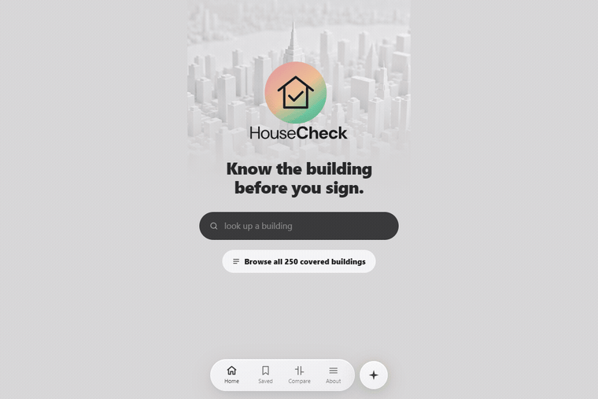

# Pursuit L2 — four cycles, four shipped products

**Stan (Aisling) Leiva-Davila** · AI-Native Builder, inaugural cohort
**[nessaisling-lab.github.io/pursuit-l2-portfolio](https://nessaisling-lab.github.io/pursuit-l2-portfolio/)**
[ness.aisling@gmail.com](mailto:ness.aisling@gmail.com) · [LinkedIn](https://linkedin.com/in/stan-leiva-davila) · [github.com/nessaisling-lab](https://github.com/nessaisling-lab)



Four builds across seven months. Every one runs — the GIF above and every screenshot in this
repo is a real build on a real machine, not a mockup and not a dev server. Two are live on the
internet right now, two are desktop applications you compile and launch. Most of the work is
**Rust**, because three of the four make a promise about what the program will *not* do, and
that is easier to hold when a compiler is checking it than when a test suite is remembering to.

---

## The four builds

| Cycle | Build | What it is | Source | Status |
|---|---|---|---|---|
| **4** | **[HouseCheck](./cycle-4-housecheck)** | Carfax for NYC apartments — a Building Health Card scored from public city data, with an export a stranger can cryptographically verify | [repo](https://github.com/nessaisling-lab/housecheck) | **[Live](https://housecheck-wine.vercel.app)** · 149 tests |
| **3** | **[Ziqpu](./cycle-3-ziqpu)** | Consumer astrology decision tool. Two visible agents — one measures, one interprets — and the separation *is* the integrity guarantee | [repo](https://github.com/nessaisling-lab/Ziqpu-L2-Cycle-3) | Runs locally |
| **2** | **[SiteAssure](./cycle-2-siteassure)** | Tamper-evident OSHA compliance logger. Append-only hash chain over safety records | [repo](https://github.com/nessaisling-lab/L2-C2-Solution) | Build from source |
| **1** | **[Resona](./cycle-1-resona)** | Privacy-first voice-to-text. 100% on-device via whisper.cpp — audio never leaves the machine | [repo](https://github.com/nessaisling-lab/L2-Project-Resona) | Installable · `v0.2.0-beta.29` |

---

## Don't take my word for any of it

The point of the Cycle 4 capstone is that its claims are checkable by someone who does not trust
me. So check them.

**Every number below is served live.** Buildings, violation count, which violation classes were
excluded and how many records that skipped, each source dataset id, and the ingest timestamp:

```bash
curl -s https://housecheck-nessa.fly.dev/meta
```

**The signing key is published separately from the documents it signs.** That is the whole point
— a signature you verify using a key carried *inside* the same document proves only that the
document is internally consistent, which a forger can also arrange:

```bash
curl -s https://housecheck-nessa.fly.dev/meta | grep -o '"export_public_key":"[^"]*"'
```

Export a record from [the live app](https://housecheck-wine.vercel.app), then check that the key
embedded in it matches the one that command returns. If it does not, the document did not come
from this system, however intact its own chain looks.

---

## Measured, not estimated

Every figure here is observed, and each links to where it was measured. Nothing on this page is
an estimate; where a number is arithmetic rather than observation, its cycle README says so.

| | | Where it comes from |
|---|---|---|
| Buildings served | **250** | ● served live — one Brooklyn community district (303) |
| Violations stored | **26,343** | ● served live |
| 311 complaint points | **221,851** | ● served live |
| Violation classes excluded | **Class I** | ● served live — 753 records skipped at ingest, and the card says so |
| Open violations | **5,168** | Cycle 4 README |
| Artifact size | **2.51 MB** | Cycle 4 README — 92.7 bytes per violation, all-in |
| Description compression | **9.89×** | Cycle 4 README — block-compressed per building |
| Search, curated path | **137–157 ms** | Cycle 4 README — warm |
| Tests | **149** | Cycle 4 README — clippy clean |
| SiteAssure | **18 commands** | Cycle 2 README — all wired, zero stubs · CI green on 3 operating systems |
| Resona | **4 GPU backends** | Cycle 1 README — one Rust core, one codebase |

● marks a figure the `/meta` command above returns, so you can re-check it right now rather than
take the table's word for it — confirmed against production on 12 August 2026. The rest are
recorded in each build's own README next to how they were taken. Splitting the column this way
is the point: a portfolio that presents live and remembered numbers in one undifferentiated list
is doing the thing this whole capstone argues against.

---

## If you only read one thing

Open **[HouseCheck's export design](./cycle-4-housecheck#the-export-is-the-hard-part)**. It is the
piece of work I would defend in an interview.

The short version: a tenant lawyer can read a building's violations on any city website. What
they cannot do is put that reading in front of a court, because a printout is unverifiable.
HouseCheck exports the record as a document carrying an append-only hash chain and an Ed25519
signature — so opposing counsel can re-check it offline, without trusting us and without reaching
our servers.

**And the part I am prouder of than the cryptography:** while verifying it in production, I wrote
an independent verifier in a different language and found that signing alone was not enough. A
forger who rewrites a row, recomputes the whole chain and signs it with their own keypair
produces a document that verifies as intact — because it is internally consistent. A row I
rewrote to read *"NO VIOLATIONS OF ANY KIND AT THIS ADDRESS"* passed cleanly. The fix was
publishing the public key at a stable endpoint so a reader has something to compare against.

That hole existed because the code's own comment said *"compare with the published one"* while
nothing published it. The comment described a system that did not exist, and it had been sitting
there long enough to read as true.

---

## How I work

Three habits that show up in every repo here. Each of them came from getting something wrong
first.

**Measure, don't estimate.** Numbers in these READMEs are measured and say so. Where a figure is
arithmetic rather than observation, it is labelled derived. Where it is unverified, it says
unverified. HouseCheck's backlog carries the rule in writing: *an item with no reason is a wish,
not a task.*

**Verify against production, not against the repo.** Nearly every real defect I found in the
final week was invisible from inside the editor — a search box that answered a Manhattan address
with a Brooklyn building, a failed lookup that silently kept the previous result on screen, an
assistant that answered a different question than the one asked. All found by using the deployed
product and checking whether what it *said* matched what it *knew*.

**An absent answer is still an answer.** Repeatedly across these builds the honest design has
three states rather than two: signed / unsigned-but-intact / tampered; a repair-time median /
"nothing has been closed since 2023" / genuinely no data. That middle state is not a nicety — one
pilot building has 33 open violations and has closed exactly one in its entire record, in October
2017. With two states it rendered blank, so the landlord who fixes nothing looked *emptier* than
one who fixes things slowly. Collapsing the middle state is how software ends up stating
something reassuring that it has not earned.

---

## What these do not do

Stating this here rather than burying it, because a portfolio that only lists wins is the same
genre of document as an unverifiable printout.

- **HouseCheck covers 250 buildings — about 0.1% of the city.** It is a signal, not a legal
  ruling, and it does not give legal advice.
- **SiteAssure has no signed installer.** It is feature-complete and uninstallable; running it
  means building from source. Its upstream repo `L2-C2-Solution` also still describes only the
  Whisper clone it grew out of, so a visitor landing there never learns SiteAssure exists.
- **Resona's hardware probe reports `32041 GB RAM` on a 32 GB machine** — megabytes labelled as
  gigabytes. It is documented in the Cycle 1 README rather than cropped out of the screenshot,
  because it is exactly the class of bug that survives by looking like a big impressive number
  instead of a wrong one.
- **Ziqpu is for reflection and entertainment.** Astrological interpretation is symbolic, not
  predictive, and the app is built to refuse advice rather than to disclaim it in a footer.

---

## What is in this repo

```
cycle-1-resona/     README + screenshots     on-device transcription
cycle-2-siteassure/ README + screenshots     tamper-evident compliance log
cycle-3-ziqpu/      README + screenshots     two-agent measurement / interpretation
cycle-4-housecheck/ README + screenshots     the capstone, and the export
index.html                                   the landing page, hand-written, no build step
```

Each cycle folder carries that build's own README and a `screenshots/` directory containing a
workflow GIF captured from the running application plus supporting stills. The desktop apps were
captured with `PrintWindow(PW_RENDERFULLCONTENT)`, because Tauri and WebView2 surfaces come back
blank in an ordinary screen grab — which is worth knowing if you ever have to document one.

---

## Stack across the four

**Rust** — axum, SQLx/rusqlite, Tauri 2, whisper-rs, ed25519-dalek, sha2
**TypeScript/React** — Vite, Tailwind
**Data** — SQLite, DuckDB, NYC Open Data (Socrata), US Census ACS
**AI** — LLM tool-calling loops with enforced grounding, structured outputs, agent guardrails
**Ops** — Docker, GitHub Actions (3-OS matrix), Fly.io, Vercel

---

*Pursuit AI-Native Builder — inaugural cohort, 600+ hours over seven months.*
