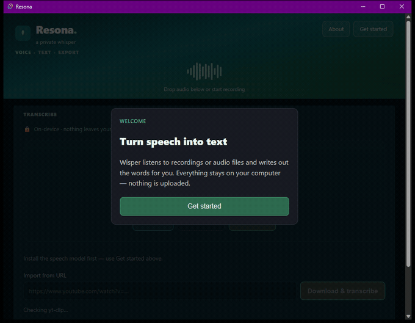
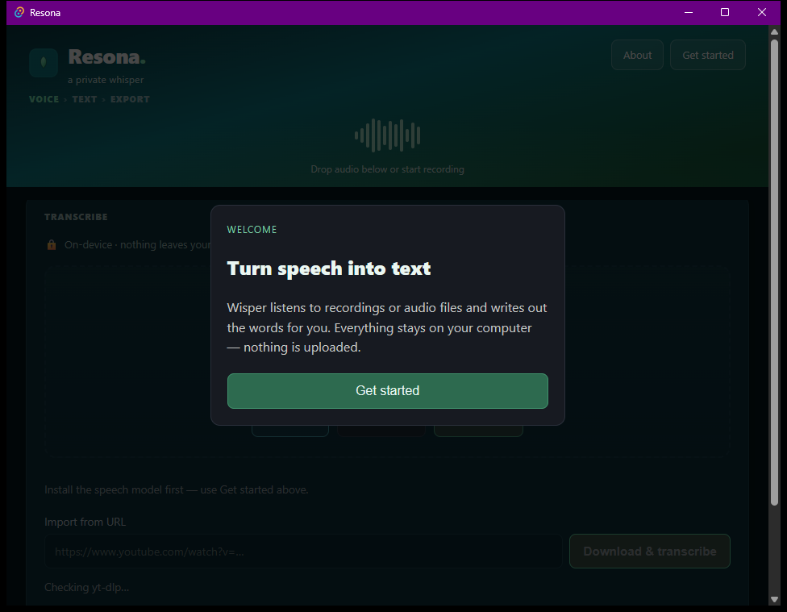
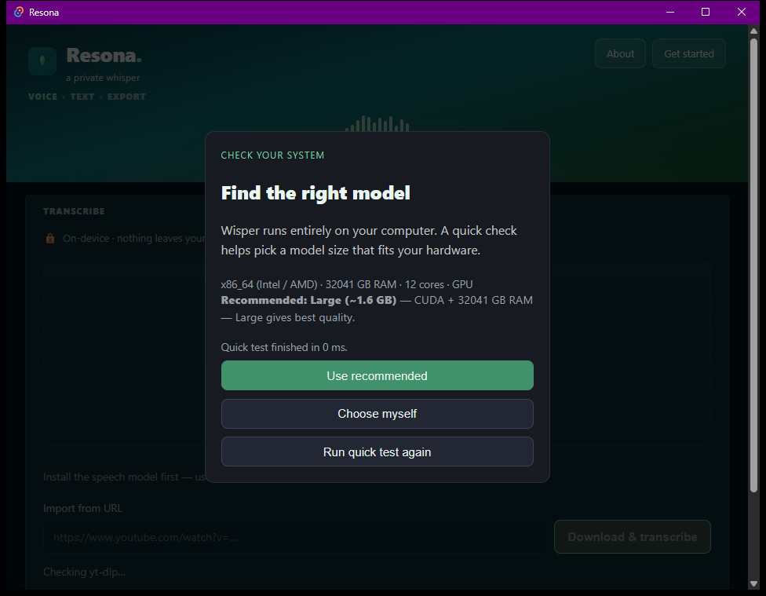

# Resona — Cycle 1

**Privacy-first voice-to-text that never sends your audio anywhere.** Live streaming dictation
and file transcription, entirely on-device via whisper.cpp.

**[Source](https://github.com/nessaisling-lab/L2-Project-Resona)**






---

## The problem

Dictation is one of the few things people do with a computer where the input is *inherently*
sensitive — therapy notes, medical dictation, legal drafting, journalism with a source on the
line. Every mainstream option streams that audio to someone else's server, and the privacy
policy is the only thing standing between the recording and a training corpus.

## The solution

Run the model locally. No cloud speech-to-text, no account required, no audio leaving the
machine — a property you can verify by unplugging the network and watching it keep working.

## Key features

- **Live streaming dictation** — microphone capture → voice-activity detection → incremental
  transcription, with results appearing as you speak rather than after you stop
- **File transcription** for existing recordings
- **Grammar review pass** — local rule-based cleanup, with an AI hook behind the paid tier
- **Tier gating enforced in the Rust core**, not in the UI, so entitlement checks are not a
  frontend suggestion
- **Hardware-aware model selection** — on first run it profiles the machine (architecture, RAM,
  core count, GPU) and recommends a whisper model size, rather than making the user guess between
  tiny and large
- **YouTube import** — paste a URL, yt-dlp fetches the audio locally, transcription stays offline
- **One codebase, four GPU backends** — the Rust core carries straight to mobile, since Tauri 2
  builds every target from the same source

## Architecture

```
src/                    React + TypeScript
  App.tsx               load model, live dictation, file upload, review, paywall
  lib/tauri.ts          invoke() wrappers, event listeners, Web Audio decode
  lib/grammar.ts        local rule-based reviewer (free) / AI hook (pro)
src-tauri/              Rust
  whisper.rs            whisper-rs wrapper — load model, transcribe buffer
  audio.rs              cpal mic capture → 16 kHz mono f32
  vad.rs                energy-based voice-activity detection
  streaming.rs          capture → VAD → incremental whisper → events
  licensing.rs          tier / entitlements / license validation
```

## Tech stack

Rust · Tauri 2 · whisper-rs (whisper.cpp) · cpal · React · TypeScript

## Status

**Installable and installed.** `v0.2.0-beta.29` from
[the release page](https://github.com/aislingld-pursuit/L2-Clone-Prodject/releases) installs and
runs; the screenshots above are that build on Windows, not a mockup or a dev server. The
unsigned-installer caveat that applies to Cycle 2 does not apply here.

**One defect visible in the shot above, and it is worth keeping:** the hardware probe reports
`32041 GB RAM` on a 32 GB machine — megabytes labelled as gigabytes. It changes nothing about the
recommendation it makes, and it is exactly the class of bug that survives because it looks like
a big impressive number rather than a wrong one.
