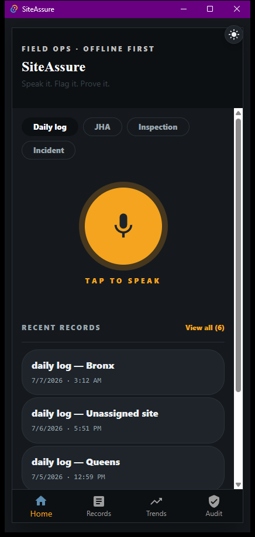
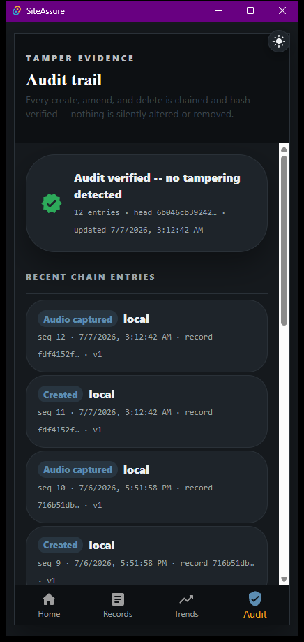

# SiteAssure — Cycle 2

**A tamper-evident, offline-first compliance logger for OSHA site records — driven by voice.**
Safety records are only worth what their provenance is worth, so the log is append-only and every
entry is chained to the one before it.

*Field ops. Offline first. Speak it. Flag it. Prove it.*

**[Source](https://github.com/nessaisling-lab/L2-C2-Solution)** *(in `siteassure/`)*

---

## The problem

A construction site's safety record is a legal document before it is anything else. When
something goes wrong, the question is not only *what did the log say* but *when was it written
and has it been touched since*. An ordinary editable log answers neither, and the incentive to
revise it runs exactly one direction — backwards, after an incident.

## The solution

An append-only log where each entry's hash includes the previous entry's hash. Editing any
historical record breaks every hash that follows it, so tampering is detectable by anyone
holding the file — not only by whoever runs the server.

This is the same construction HouseCheck's export uses two cycles later. It was built here
first, for OSHA records, and carried forward because the property it gives you — *a document
whose integrity does not depend on trusting its custodian* — turned out to be the thing that
made the Cycle 4 capstone worth building.

## Key features

- **Append-only hash chain** over compliance entries; one altered character invalidates
  everything after it
- **Egress hardening** — network access reduced to an explicit allowlist rather than a
  kill-switch, so a new call site cannot quietly reach the internet by default
- **CI across three operating systems** — GitHub Actions matrix, green on Windows and macOS
- **MIT licensed**, crediting both authors

## Tech stack

Rust · cross-platform desktop · GitHub Actions (3-OS matrix)

## Status and honesty

The application is feature-complete — 18 commands, all wired, zero stubs — and **uninstallable**:
there is no signed installer yet, so running it means building from source. That is the honest
status and it is tracked as the next task rather than hidden.

## Where it came from

Cycle 2 began as a **Whisper Notes clone** — on-device transcription, built with
[Jimmy Ong](https://github.com/jimmyronin). SiteAssure is what that became when the question
changed from *can I transcribe this* to *what is transcription actually for*. The answer was a
construction foreman who cannot type on a site and whose spoken record has to hold up later.

That lineage is why the app opens on a microphone rather than a form, and why the audit trail
exists at all: the moment a voice note becomes a legal record, the interesting problem stops
being accuracy and starts being provenance.

**Known issue with the repo:** `L2-C2-Solution` still holds both `wisper/` and `siteassure/`, and
its README describes only the clone — so anyone landing there never learns SiteAssure exists.
Fixing that README is the highest-value change available to that repo, and it is not code.
