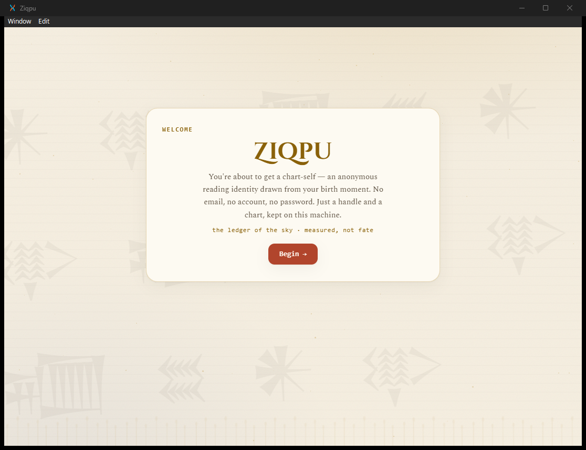
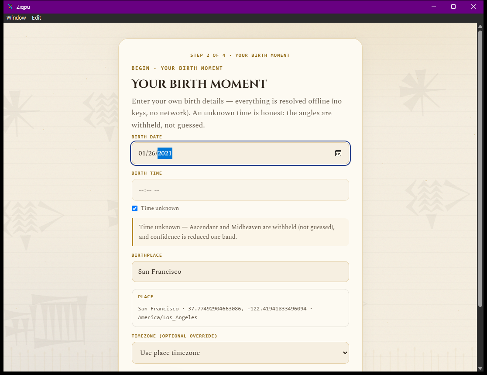
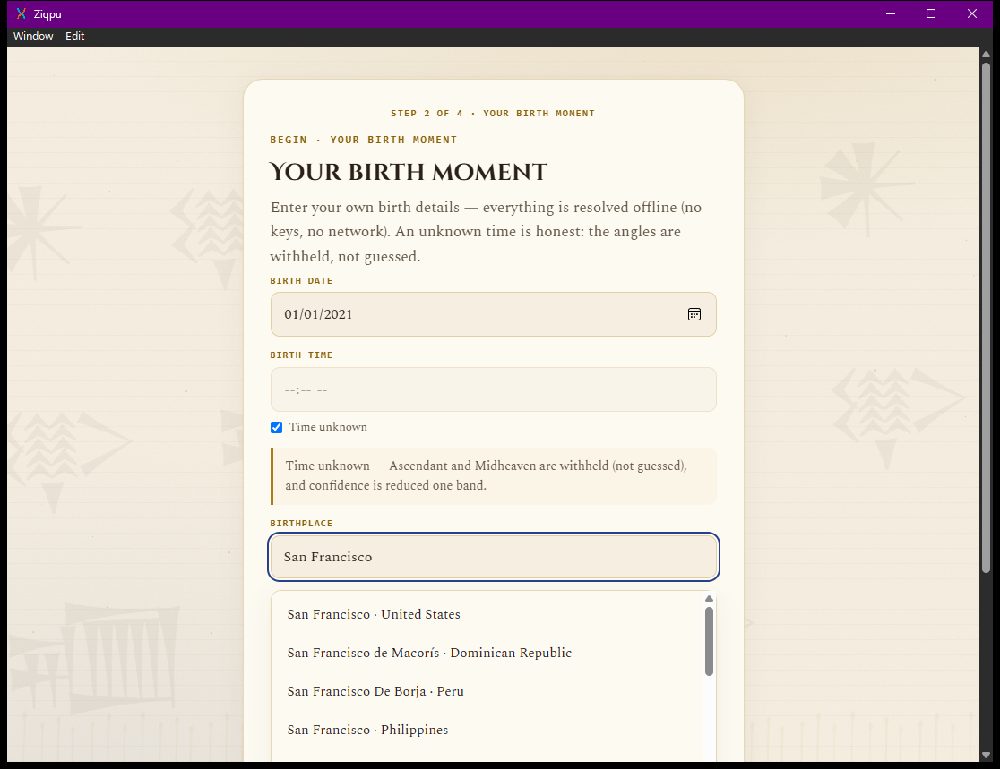

# Ziqpu — Cycle 3

**A consumer astrology decision tool where the architecture *is* the integrity guarantee.** Your
natal chart against the natal chart of a choice you are weighing — measured from real ephemeris
data, read back in plain language, and never dressed up as fate.

**[Source](https://github.com/nessaisling-lab/Ziqpu-L2-Cycle-3)**

*Driven with **Anthropic's own founding date — 26 January 2021**, San Francisco, California,
United States. Anthropic is a Delaware public benefit corporation headquartered in San Francisco;
the date is [publicly documented](https://en.wikipedia.org/wiki/Anthropic), the incorporation
**hour is not**. So the time is marked unknown — and the app responds by withholding the
Ascendant and Midheaven and lowering its confidence one band, rather than guessing them. Filling
in a plausible-looking time would have produced two angles that look like measurements and are
not, which is the exact failure the two-agent split exists to prevent.*

> *"An unknown time is honest: the angles are withheld, not guessed."* — the app's own copy on
> the birth-details screen. The same rule the rest of these builds follow: an absent answer is
> stated, never filled in.

---

## The problem

Astrology apps blur two very different acts: computing where the planets were, and telling you
what it means. The first is arithmetic and can be exact. The second is interpretation and cannot
be. When one system does both invisibly, a user has no way to tell which part of an answer is a
measurement and which is a story — and the product's incentive is to let them assume it is all
measurement.

## The solution

**Two visible agents, and the separation is the product.**

- **Hamun-ana — the measurer.** Computes exact positions and aspects. Returns structured JSON
  only. *Never interprets.*
- **Ungasaga — the interpreter.** Turns those measures into a reading in three beats —
  **measured → meaning → reminder** — and refuses to give advice.

Measurement and meaning are distinct *by architecture*, not by disclaimer. A user can see which
agent produced which part of the answer.

## Key features

**Synastry as a decision lens.** The v1 domain is stocks, dated by their IPO moment, but the
engine is domain-agnostic: anything with a date of origin — a founding, a launch, a policy's
effective date — can be charted.

**Orchestrator-and-workers tool loop.** Code narrows the roster to the tools that could possibly
apply, *then* the model chooses among those. The measurement sequence is fixed and never
model-chosen, so the arithmetic cannot be influenced by a language model. Grounding lookups are
dispatched by what the entity actually *is*, so impossible lookups are never attempted.

**Refusal as a feature.** The interpreter is built to decline advice. Nothing here is financial,
medical, legal, or psychological guidance, and the system is designed so that saying so is not
merely a footer.

## Tech stack

Rust · LLM tool-calling with enforced grounding · structured outputs · real ephemeris data

## What it does not claim

Ziqpu is for reflection and entertainment. Astrological interpretations are traditional and
symbolic — not statements of fact, not predictions, not guarantees.
