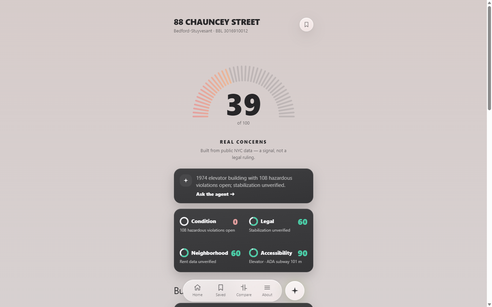

# HouseCheck — Cycle 4

**Carfax for NYC apartments.** Type an address, get a Building Health Card scored from public
city data, and export a record a stranger can cryptographically verify.

**[Live demo](https://housecheck-wine.vercel.app)** · **[Source](https://github.com/nessaisling-lab/housecheck)**



---

## The problem

Before you sign a New York lease, the information that would tell you whether the building is
maintained already exists — HPD violations, 311 complaints, rent-stabilization records — and it
is public. It is also spread across four agency websites in formats designed for clerks, not
renters. Practically nobody checks, because checking is an afternoon's work per building.

The harder problem sits one level up. A tenant lawyer *can* read those violations. What they
cannot do is put that reading in front of a court: a printout is unverifiable, and a count they
hand-copied is hearsay about hearsay.

## The solution

One search field over 250 real Bed-Stuy buildings. A 0–100 score across four pillars —
condition, legal, neighborhood, accessibility — with every number linked to the city dataset it
came from. And an export that survives leaving us.

## Key features

**Building Health Card.** Four pillar scores and the violation text behind them, in HPD's own
words, with how long each has been open. The card refuses to imply more than it knows: a
building with no Class C violations and a floor-level score gets a sentence reconciling the two,
because a count read alone can be read backwards.

**Repair speed.** Median days from a violation being issued to being closed. The only measure
on the card describing *behaviour* rather than state — two buildings can show identical open
counts while one fixes things in three weeks and the other in three years. Three states, not
two: a median, "nothing closed since 2023", or genuinely no data. The middle state exists
because one pilot building has 33 open violations, has closed one in its entire record, and that
closure was in October 2017 — with two states it rendered blank, so the landlord who fixes
nothing looked *emptier* than one who fixes things slowly.

**Verifiable export.** Three destinations — copy as text, download as JSON, print — over one
signed record. Details below.

**Grounded assistant.** Answers only from the building's own record, with citations that list
the sources which actually fed the answer rather than a hardcoded line. It never predicts case
outcomes and says so.

**Honest failure.** A search that cannot run says which failure it hit — "we couldn't reach the
address service" is a different sentence from "address not found", and conflating them tells
someone their home does not exist when the truth is that a server is down.

## The export is the hard part

The document carries an append-only hash chain: `entry_hash[i] = sha256(entry_hash[i-1] ++
payload_hash[i])`. Change one character of one violation and every hash from that row onward
changes. The chain head is signed with Ed25519.

**Two claims, deliberately separated.** The chain proves the document was not altered after we
produced it. It says nothing about whether our output matched HPD — so each source's dataset id
and retrieval timestamp travel *inside* the signed region. Without them this would be an exhibit
about itself.

**Three verification outcomes, not two:** signed-and-intact, intact-but-unsigned, tampered.
Collapsing the middle one would let an unsigned document pass as an authenticated one.

**Verified from outside.** I wrote an independent verifier in Python — different language,
different crypto library, document as the only input — and reproduced all three states:

```
as delivered      : SIGNED AND INTACT, key matches /meta
one char altered  : TAMPERED: row 0 payload hash
two rows swapped  : TAMPERED: row 0 chain link
signature removed : INTACT BUT UNSIGNED
```

**And it found a hole.** A forger who rewrites a row, recomputes the *whole chain*, and signs it
with their own keypair produces a document that verifies as intact — every check inside it
passes, because it is internally consistent. A row rewritten to "NO VIOLATIONS OF ANY KIND AT
THIS ADDRESS" passed cleanly. The only defence is comparing the embedded key against one
published independently, and nothing published it. Now `/meta` serves the public key and the
transcript instructs the comparison — after which the same forgery is rejected.

## Tech stack

**Backend** — Rust, axum 0.8, rusqlite, ed25519-dalek, sha2. Read-only SQLite artifact baked
into the Docker image; no database server, no connection pool, no cold-start query.
**Frontend** — React, TypeScript, Vite, Tailwind.
**Data** — NYC HPD violations, 311, PLUTO, DOB, DOHMH, US Census ACS. Ingested with completeness
checks, block-compressed per building (measured **9.89×** on descriptions).
**Deploy** — Fly.io (backend), Vercel (frontend).

## Measured, not estimated

| | |
|---|---|
| Buildings served | 250 (one Brooklyn community district) |
| Violations stored | 26,343 — of which 5,168 open |
| Artifact size | 2.51 MB, 92.7 B per violation all-in |
| Description compression | 9.89× |
| Search, curated path | **137–157 ms** warm |
| Tests | 149, clippy clean |

## What it does not do

Coverage is 250 buildings — 0.1% of the city. Class I violations are excluded (753 skipped at
ingest) and the card says so. It is a signal, not a legal ruling, and it does not give legal
advice. The stated limitations live in the repo's own backlog alongside the measurements that
justify them.
